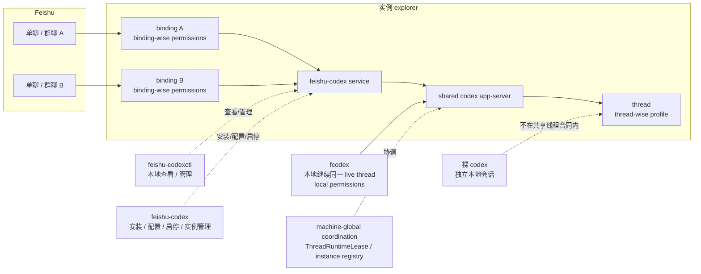
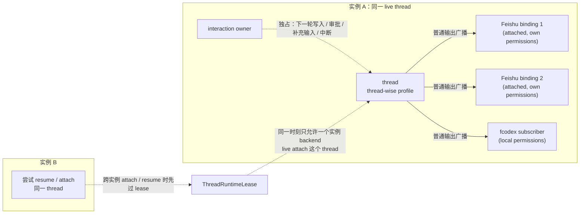

# feishu-codex

`feishu-codex` 把飞书机器人、本地 `fcodex` 和同一个 `codex app-server`
接到一起。

它不是把 Codex TUI 直接搬进飞书；它提供的是：

- 飞书里的 thread 使用入口
- 本地继续同一 live thread 的 `fcodex`
- 本地查看 / 管理面 `feishu-codexctl`

## 这是什么

你可以把它理解成一层桥接：

- 飞书会话先绑定到某个 `thread`
- 这个 `thread` 跑在某个实例自己的 shared backend 上
- 飞书和 `fcodex` 只要连到同一个实例 backend，就能安全继续同一个 live thread

最重要的一条：

- 想让飞书和本地安全地继续同一个 live thread，用 `fcodex`
- 裸 `codex` 仍然可以单独用，但不在共享线程合同内

## 怎么使用

先记住 4 个入口：

| 入口 | 作用 | 什么时候用 |
| --- | --- | --- |
| 飞书聊天命令 | 当前 chat binding 的使用入口 | 在飞书里提问、切线程、改当前会话设置 |
| `feishu-codex` | 配置、启停、登录后自动启动、实例管理 | 管理本地服务 |
| `fcodex` | 接到同一实例 shared backend 的本地 Codex 入口 | 想在本地继续飞书正在操作的同一 live thread |
| `feishu-codexctl` | 本地查看 / 管理面 | 看 binding / thread / service 状态，做 thread-scoped 管理 |

如果只是本地独立使用，不需要和飞书共用 live thread，也可以直接用裸 `codex`。

## 快速开始

### 前置条件

- Python 3.11+
- 本机已安装 `codex` CLI，且 `codex --help` 可正常执行
- 已在飞书开放平台创建应用，拿到 `app_id` 与 `app_secret`

### 1. 安装

macOS / Linux：

```bash
cd /path/to/feishu-codex
bash install.sh
```

Windows PowerShell：

```powershell
cd \path\to\feishu-codex
.\install.ps1
```

开发期间只支持这两条安装 / 修复路径：

- `bash install.sh`
- `.\install.ps1`

不要使用：

- `pip install .`
- `pip install -e .`

### 2. 配置飞书应用

推荐先一次性配好权限、事件与回调。

建议权限：

- `application:application:self_manage`
- `contact:contact.base:readonly`
- `contact:user.base:readonly`
- `contact:user.employee_id:readonly`
- `im:message`
- `im:message.group_at_msg:readonly`
- `im:message.group_msg`
- `im:message.p2p_msg:readonly`
- `im:message:readonly`
- `im:message:send_as_bot`
- `im:message:update`

<details>
<summary>一键导入权限 JSON（点击展开）</summary>

在飞书开放平台「权限管理」页面点击「批量开通」，粘贴以下 JSON 即可导入当前建议权限集：

```json
{
  "scopes": {
    "tenant": [
      "application:application:self_manage",
      "contact:contact.base:readonly",
      "contact:user.base:readonly",
      "contact:user.employee_id:readonly",
      "im:message",
      "im:message.group_at_msg:readonly",
      "im:message.group_msg",
      "im:message.p2p_msg:readonly",
      "im:message:readonly",
      "im:message:send_as_bot",
      "im:message:update"
    ]
  }
}
```

</details>

在「事件与回调」中启用：

- WebSocket 长连接模式
- 事件：`im.message.receive_v1`
- 回调：`card.action.trigger`

本项目默认走长连接，不需要公网 webhook URL。

### 3. 填本地配置

打开系统配置：

```bash
feishu-codex config system --open
```

按需写入 provider 环境变量：

```bash
feishu-codex config env --open
```

最小需要填的通常是：

- `system.yaml` 里的 `app_id`、`app_secret`
- `feishu-codex.env` 里的 provider key 或其他环境变量

### 4. 启动服务并初始化管理员

如需登录后自动启动：

```bash
feishu-codex autostart enable
```

启动服务：

```bash
feishu-codex start
```

查看初始化口令：

```bash
feishu-codex config init-token
```

然后在飞书里私聊机器人：

```text
/init <token>
```

这一步会把当前发送者登记为管理员，并尝试写入当前机器人的 `bot_open_id`。

### 5. 开始使用

在飞书里：

- 发送 `/help` 看导航
- 直接发送普通文本开始对话
- 用 `/new`、`/resume`、`/profile`、`/cd` 管理当前会话绑定的 thread
- 群聊里先用 `/group activate` 激活，再按群模式使用

在本地继续同一个 live thread：

```bash
fcodex
fcodex resume <thread_id|thread_name>
fcodex --instance corp-a
```

本地查看 / 管理：

```bash
feishu-codexctl service status
feishu-codexctl binding list
feishu-codexctl thread list --scope cwd
feishu-codexctl thread status --thread-name <name>
feishu-codexctl image send --path ./diagram.png
```

### 6. 多实例

如果你需要多个机器人实例：

```bash
feishu-codex instance create corp-a
feishu-codex --instance corp-a config system --open
feishu-codex --instance corp-a start
fcodex --instance corp-a
```

每个实例有自己的：

- 配置目录
- 数据目录
- service
- shared backend

所有实例共享：

- `CODEX_HOME`
- 持久化 thread 命名空间
- 机器级 `ThreadRuntimeLease`

## `profile` 与 `permissions` 怎么生效

这两个概念不在同一层：

- `profile` 跟着 `thread` 走
- `permissions` 跟着“谁从哪里发起这一轮 turn”走

| 你设置的是什么 | 在哪里设置 | 持久化到哪里 | 什么时候生效 |
| --- | --- | --- | --- |
| 当前 thread 的 `profile` | 飞书 `/profile <name>` | machine-global 的 thread-wise store | 该 thread 下次从 unloaded 状态恢复时生效；若当前实例可控且仍 loaded，则走显式 reset backend 路径 |
| 新开的第一个 thread 的 `profile` seed | `fcodex -p <profile>` | 线程真正创建成功后，按 `thread_id` 写入 thread-wise store | 只作用于这次启动创建的第一个新 thread |
| 已有 thread 的 `profile` | `fcodex -p <profile> resume <thread>` | machine-global 的 thread-wise store | 目标 thread verifiably globally unloaded 时，先写入，再按该配置恢复 |
| 当前飞书会话的 `permissions` / `approval` / `sandbox` | 飞书 `/permissions`、`/approval`、`/sandbox` | 当前 chat binding | 只影响这个飞书会话后续发起的 turn |
| 本地 `fcodex` 发起 turn 的权限设置 | 本地 `fcodex` / upstream Codex 自己的设置面与配置 | 本地 Codex 配置 | 只影响本地发起的 turn，不会自动同步到飞书 binding |

再记住 4 条：

- `permissions` 是一个预设，会同时修改 `approval_policy` 和 `sandbox`
- 同一个 thread 可以被多个前端继续，但它们不共享一套即时同步的 `permissions`
- 真正执行某一轮 turn 时，采用的是“发起这一轮的那个前端”当下的权限设置
- 飞书 `/status` 看到的是：当前绑定 thread 的 `profile`，以及当前飞书会话自己的 `permissions` / `approval` / `sandbox`

## 更多帮助

- 飞书里发送 `/help`
- 本地查看 `feishu-codex --help`
- 本地查看 `feishu-codexctl --help`
- 深入文档看 `docs/doc-index.zh-CN.md`

按主题查文档时，最常用的是：

| 你想确认什么 | 先看哪里 |
| --- | --- |
| 总体架构、模块边界、仓库结构 | `docs/architecture/feishu-codex-design.zh-CN.md` |
| `fcodex` shared backend、动态端口、cwd 代理 | `docs/architecture/fcodex-shared-backend-runtime.zh-CN.md` |
| `/status`、`/preflight`、`/reset-backend`、本地控制面状态词汇 | `docs/contracts/runtime-control-surface.zh-CN.md` |
| 飞书线程生命周期、绑定与释放 | `docs/contracts/feishu-thread-lifecycle.zh-CN.md` |
| `/threads`、`/resume`、`/profile` 的当前语义 | `docs/contracts/thread-profile-semantics.zh-CN.md` |
| shared backend 与 `/resume` 的安全边界 | `docs/decisions/shared-backend-resume-safety.zh-CN.md` |

## 一图看懂架构



这张图只表达 3 件事：

- 飞书会话先绑定 `thread`
- `fcodex` 连的是同一个实例 backend
- 裸 `codex` 不在共享线程合同内

## 一图看懂共享与冲突控制



这张图表达的是当前运行时合同：

- 多个 `attached` 订阅者可以同时收到同一 thread 的 backend 普通消息
- 多订阅不等于多方都能写；真正的写入与交互控制由 `interaction owner` 独占
- 不同实例不能同时 live attach 同一个 thread；这由机器级 `ThreadRuntimeLease` 控制
