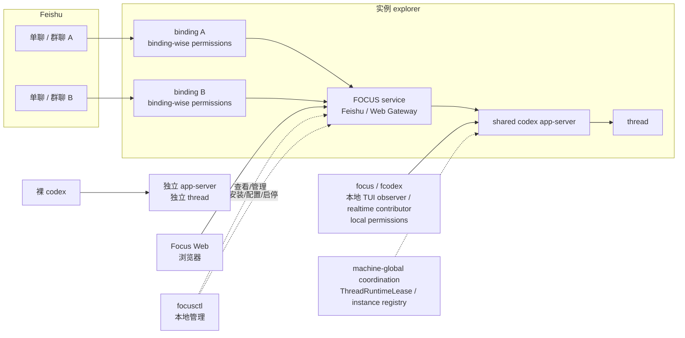

# FOCUS

> 说明：本项目最开始来源于 [shenman9/feishu_bot](https://github.com/shenman9/feishu_bot)。更准确地说，它是从 `feishu_bot` 中用于“飞书 + Claude Code”的那部分子集能力演进而来，并在此基础上改造成面向 Codex 的实现，最终形成当前的 FOCUS。

**FOCUS - Feishu, Online Codex for Users and Sharing** 把飞书机器人、本地 Codex TUI 和同一个 `codex app-server`
接到一起。

本项目提供：

- 飞书里的 codex thread 使用入口
- 本地接入同一 Codex live thread、贡献实时输入与控制的 `focus`
    - `fcodex` 是 `focus` 的等价别名，强调 Codex TUI thin wrapper 语义
- 本地查看 / 管理面 `focusctl`

你可以把它理解成一层桥接：

- 飞书会话先绑定到某个 `thread`
- 这个 `thread` 跑在某个 FOCUS 实例自己的 shared backend 即 `codex app-server` 上
- 飞书、Web 与 `focus` / `fcodex` 可以连接同一个实例 backend，观察同一个 live thread
- Web / `fcodex` 的普通输入采用 upstream start-or-steer：空闲时开始新一轮，运行中时补充当前轮；飞书普通输入按 next-turn/FIFO 进入后续轮
- `model`、`effort`、`permissions` 等由各前端分别保存，不自动同步；飞书和 Web 的设置只在各自下一次符合条件的 start/resume 时带入，steer 不改变当前轮。另一前端之后启动新轮时，可能以自己的值更新这个 thread 的可观察 effective settings
- 裸 `codex` 仍然可单独使用，裸 `codex` 将使用自己的独立 backend，不在共享线程合同内

## 使用入口

| 入口 | 作用 | 什么时候用 |
| --- | --- | --- |
| 飞书聊天命令 | 当前 chat binding 的使用入口 | 在飞书里提问、切线程、改当前会话设置 |
| `focus` / `fcodex` | 本地 Codex TUI，接到同一实例 shared backend | 想在本地观察同一 live thread，并贡献普通 prompt 或 exact-turn 控制 |
| `focusctl` | 本地管理面 | 配置、启停、实例、binding、thread、prompt、image、清理 |
| `focusd` | daemon 入口 | 由 service manager 调用，通常不手敲 |

## 快速开始

### 安装环境

- 带 `venv` / `ensurepip` 的 CPython 3.11+
- Linux 使用可用的 `systemd --user`，macOS 使用 launchd，Windows 使用 Task Scheduler
- 本机已安装 `codex` CLI，且 `codex --help` 可正常执行
- 已在飞书开放平台创建应用，拿到 `app_id` 与 `app_secret`

### 1. 安装

macOS / Linux：

```bash
cd /path/to/focus
bash install.sh
```

默认从本仓库 GitHub Releases 下载最新 stable bundle。已下载或本地 bundle
（`--artifact`，无需解压）以及代理边界见 `bash install.sh --help`。
如需指定解释器，可执行 `FOCUS_INSTALL_PYTHON=/path/to/python3.13 bash install.sh`。

需要安装当前源码 workspace，而不是 GitHub Release 时，在首次 clone、
`web/package-lock.json` 变化或 `node_modules` 缺失后先执行一次 `npm --prefix web ci`，
日常构建和安装只需：

```bash
bash scripts/install_workspace.sh
```

该脚本构建 Web 与临时 local bundle，再把准确的 bundle 路径交给正式安装器；它不会发布制品。

Windows PowerShell：

```powershell
cd \path\to\focus
.\install.ps1
```

PowerShell 中对应的完整安装帮助为 `.\install.ps1 --help`。

Windows 安装会把 `%LOCALAPPDATA%\focus\bin` 写入当前用户的 `PATH`；
通常新开一个 PowerShell / cmd 后即可直接发现 `focus`、`focusd`、
`focusctl`、`fcodex`。
Windows 当前不安装 shell completion。

不要使用 `pip install .` 或 `pip install -e .`，这将安装无法被卸载命令 `focusctl uninstall/purge` 覆盖的残留命令入口。

从旧 `feishu-codex` 本地安装迁移时，安装 FOCUS 后执行：

```bash
focusctl migrate from-feishu-codex
```

首次安装时也可向 `install.sh` 或 `install.ps1` 传入 `--migrate-from-feishu-codex`。迁移是一次性 transfer；成功后主路径只使用 `focus` 目录、命令和 service。

**移除**

- `focusctl uninstall` 会删除 service、wrapper、completion 与受管 `.venv`，但保留配置和其他数据
- `focusctl purge` 再删除经 marker 核验的受管 config/data 根
- 二者只在所有实例可证明 idle 时执行

### 2. 配置飞书应用

推荐先一次性配好权限、事件与回调。

#### 权限

权限用途概览

  - 初始化与机器人自识别: `/init`, `/bot-status`
      - `application:application:self_manage`
  - 用户与群成员身份识别: 群成员称呼, `/whoami` 身份信息获取
      - `contact:contact.base:readonly`
      - `contact:user.base:readonly`
      - `contact:user.employee_id:readonly`
  - 群聊名称读取: `focusctl binding list --refresh-names` 刷新 `CHAT` 列群名缓存
      - `im:chat:readonly`
  - 接收单聊与群聊消息
      - `im:message.p2p_msg:readonly`
      - `im:message.group_at_msg:readonly`
      - `im:message.group_msg`
  - 读取消息、发送回复、更新卡片
      - `im:message`
      - `im:message:readonly`
      - `im:message:send_as_bot`
      - `im:message:update`
  - 发送图片到飞书
      - `im:resource`

<details>
<summary>一键导入权限 JSON（点击展开）</summary>

在飞书开放平台「权限管理」页面点击「批量开通」，粘贴以下 JSON 即可导入当前建议权限集：

```json
{
  "scopes": {
    "tenant": [
      "application:application:self_manage",
      "contact:contact.base:readonly",
      "contact:user.base:readonly",
      "contact:user.employee_id:readonly",
      "im:chat:readonly",
      "im:message",
      "im:message.group_at_msg:readonly",
      "im:message.group_msg",
      "im:message.p2p_msg:readonly",
      "im:message:readonly",
      "im:message:send_as_bot",
      "im:message:update",
      "im:resource"
    ]
  }
}
```

</details>

#### 事件与回调

在「事件与回调」中启用：

- WebSocket 长连接模式
- 事件：`im.message.receive_v1`
- 事件：`im.message.recalled_v1`（用于撤回仍在队列中的消息）
- 事件：`im.chat.disbanded_v1`（群解散后停用并清理该群的本地 binding）
- 事件：`im.chat.member.bot.deleted_v1`（机器人被移出群后停用并清理该群的本地 binding）
- 回调：`card.action.trigger`

本项目默认走长连接，不需要公网 webhook URL。

同一个飞书 `app_id` 只支持一个 Focus service 长连接。Focus 会在同一台机器上拒绝重复
连接；不要在多台机器或集群中用同一个 `app_id` 并行部署，因为飞书可能把事件投递到
任意连接，当前版本无法在跨机器场景证明持有 binding 的进程一定收到失联事件。

### 3. 本地启动、配置、初始化

打开系统配置：

```bash
focusctl config system --open
```

按需写入 provider 环境变量：

```bash
focusctl config env --open
```

最小需要填的通常是：

- `system.yaml` 里的 `app_id`、`app_secret`
- `focus.env` 里的 provider key 或其他环境变量

启动服务：

```bash
focusctl service start
```

如需登录后自动启动：

```bash
focusctl service autostart enable
```

查看初始化口令：

```bash
focusctl config init-token
```

然后在飞书里私聊机器人：

```text
/init <token>
```

这一步会把当前发送者登记为管理员，并尝试写入当前机器人的 `bot_open_id`。
非管理员普通私聊默认不能直接使用机器人；但 `/whoami`、`/bot-status`、`/init <token>` 这类身份与初始化命令仍可在私聊使用。

### 4. 开始使用

在飞书里：

- 发送 `/help` 或 `/h` 看可用命令导航
- 发送 `/commands` 看可用命令列表
- 直接发送普通文本开始对话
- 手动发送命令 `/new`、`/resume`、`/cd` 管理当前会话绑定的 thread
- 如果想让同一个机器人同时服务多个项目，建议为每个项目单独建一个群聊；每个群聊固定在自己的目录和 thread 上，避免在单聊里反复 `/cd`、`/resume`
- 群聊里管理员先用 `/group activate` 激活，再按群模式使用

在本地接入同一个 live thread（空闲时经 blank-submission 准入后才可发起下一轮）：

```bash
focus
focus resume <thread_id|thread_name>
focus --instance corp-a
```

或等价的

```bash
fcodex
fcodex resume <thread_id|thread_name>
fcodex --instance corp-a
```

说明：`--instance <name>` 只接受已创建的命名实例；如未创建，先执行 `focusctl instance create <name>`。

打开本机浏览器前端：

```bash
focusctl web open
```

全新安装默认启用 Web；从 3.0.2 等旧配置升级后若提示未启用，请用
`focusctl config codex --open` 设置 `web_enabled: true`，再执行 `focusctl service restart`。

Focus Web 默认只监听 loopback。SSH local forwarding 仍属于 local mode；浏览器若通过
non-loopback external origin 访问，则必须经过已配置的可信 HTTPS 反向代理。完整的安全边界、
配置与部署清单见 [Focus Web 自部署外部访问](docs/decisions/focus-web-external-access.zh-CN.md)。

本地查看 / 管理：

```bash
focusctl service status
focusctl binding list
focusctl thread list
focusctl thread status --thread-name <name>
focusctl thread goal --thread-name <name>
focusctl image send --thread-id <thread_id> --path ./diagram.png
```

说明：`focusctl --instance <name> ...` 同样不会隐式创建命名实例。

#### 可选进阶

如果你已经完成基本安装与初始化，再看这部分：

- `focusctl prompt send --binding-id ...` 可向某个既有 Feishu 会话合成发起一轮 prompt；若不同会话各自绑定到不同 thread，它也可作为多个 thread 之间显式协作的控制面入口。
- `/goal` 用于查看或管理当前 thread 的 goal；常用形态包括 `/goal`、`/goal text`、`/goal set <objective>`、`/goal pause`、`/goal resume`、`/goal clear`。本地查看或排障时，可配合 `focusctl thread goal --thread-name <name>` 一起用。如需让机器人帮助生成 goal 主句，可先用 `/last text` 获取当前会话最近的权威终态文本，方便在手机侧复制后再整理成主句。
- `focusctl image send` 是 thread-scoped 动作：在 Codex turn 内可依赖自动注入的 `CODEX_THREAD_ID` 把图片发回当前 thread；若目标不是当前 thread，则必须显式提供 `--thread-id` 或 `--thread-name`。
- 若在 Codex turn 中已经有本地图片文件，可用 `feishu-send-image` skill 调 `focusctl image send`，把图片发回当前 thread 当前 attached 的飞书会话；这个 skill 不负责跨 thread / 手动选目标。

### 5. 多机器人多实例

如果你希望配置多个飞书应用及机器人，每个机器人对应不同的 FOCUS 实例，可按下面方式创建命名实例：

```bash
focusctl instance create corp-a
focusctl --instance corp-a config system --open
focusctl --instance corp-a service start
focus --instance corp-a
fcodex --instance corp-a
```

每个实例有自己的：

- 配置目录
- 数据目录
- service
- shared backend

额外说明：

- 命名实例只读取自己实例目录下的 `system.yaml` / `codex.yaml`
- 它不会继承 `default` 实例的 `codex.yaml`
- 真实 `codex.yaml` 是实例级 override 文件；通常只保留显式设置过的键
- 如需查看完整可配项，应看同目录 `codex.yaml.example`

所有实例共享：

- `CODEX_HOME`
- 持久化 thread 命名空间
- 机器级 `ThreadRuntimeLease`

## 更多帮助

- 飞书里发送 `/help` 或 `/h`
- 本地查看 `focus --help` 或 `fcodex --help`
- 本地查看 `focusctl --help`
- 深入文档看 [文档索引](docs/doc-index.zh-CN.md)

## 一图看懂架构


```mermaid
flowchart LR
  subgraph Feishu["Feishu"]
    ChatA["单聊 / 群聊 A"]
    ChatB["单聊 / 群聊 B"]
  end

  Web["Focus Web<br/>浏览器"]
  Work["focus / fcodex<br/>本地 TUI observer / realtime contributor<br/>local permissions"]
  CTL["focusctl<br/>本地管理"]
  Raw["裸 codex"]
  RawBackend["独立 app-server<br/>独立 thread"]

  subgraph Instance["实例 explorer"]
    BindA["binding A<br/>binding-wise permissions"]
    BindB["binding B<br/>binding-wise permissions"]
    Service["FOCUS service<br/>Feishu / Web Gateway"]
    Backend["shared codex app-server"]
    Thread["thread"]
  end

  Global["machine-global coordination<br/>ThreadRuntimeLease / instance registry"]

  ChatA --> BindA --> Service
  ChatB --> BindB --> Service
  Web --> Service
  Service --> Backend --> Thread
  Work --> Backend
  CTL -.查看/管理.-> Service
  CTL -.安装/配置/启停.-> Service
  Global -.协调.-> Backend
  Raw --> RawBackend
```

这张图只表达 3 件事：

- 飞书会话先绑定 `thread`，Web 也通过同一个实例 service 访问 shared backend
- `focus` / `fcodex` 连到这个 shared backend，可以观察和操作同一个 live thread
- 裸 `codex` 使用自己的 backend 与 thread，不进入 Focus 的共享合同
