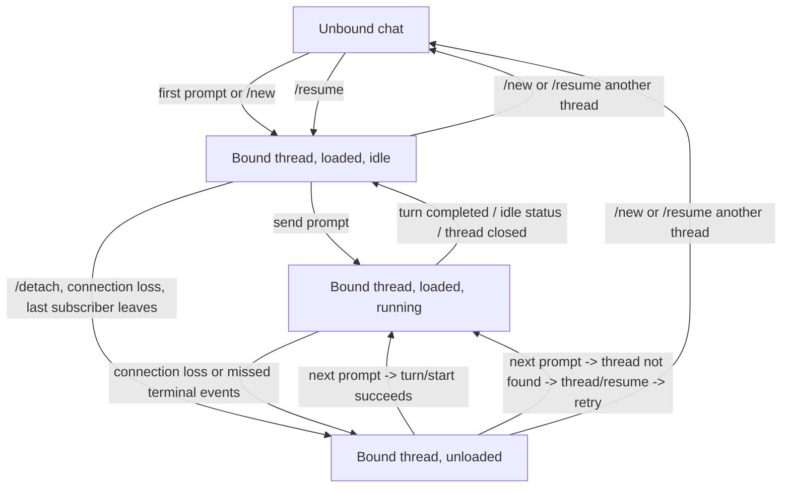

# Feishu Thread Lifecycle

Chinese version: `docs/contracts/feishu-thread-lifecycle.zh-CN.md`

This document defines the current thread lifecycle contract for the Feishu side.
It explains why Feishu must follow the same backend contract as `fcodex`, while
still using a different runtime recovery model.

See also:

- `docs/architecture/fcodex-shared-backend-runtime.md`
- `docs/contracts/runtime-control-surface.md`
- `docs/decisions/shared-backend-resume-safety.md`
- `docs/contracts/thread-next-load-settings-semantics.md`
- `docs/contracts/thread-profile-semantics.md`

## 1. Verified Baseline

- Upstream project: [`openai/codex`](https://github.com/openai/codex.git)
- Locally verified baseline: `codex-cli 0.118.0`, resolved locally to upstream
  tag `rust-v0.118.0` (`b630ce9a4e754d35a1f33e4366ba638d18626142`) on
  2026-04-03
- If this document later needs specific upstream source references, prefer
  commit-pinned `openai/codex` permalinks against that baseline instead of
  developer-local checkout paths

## 2. Four States That Must Not Be Confused

For one Feishu chat, the following are different facts:

1. `binding`
   - which `thread_id` this Feishu chat is logically attached to
2. `subscription`
   - whether the current live connection is still subscribed to that thread
3. `loaded runtime`
   - whether the thread is currently loaded in app-server memory
4. `running turn`
   - whether a turn is currently executing

The Feishu implementation uses `binding` as the chat-local source of truth.
`loaded runtime` is a recoverable runtime fact, not the binding fact.

In the current repo wording, Feishu now explicitly exposes this as the chat's
Feishu push attachment state:

- `attached`
  - the Feishu service is still subscribed to that thread
- `detached`
  - the binding remains, but this Feishu chat is no longer receiving push for
    that thread

This is only a stricter name for the `subscription` fact. It does not change
the requirement to keep it distinct from `binding` and `loaded runtime`.

For operational control, keep `interaction owner` separate from the binding/runtime state axes.

`interaction owner` is a current-instance temporary lease. It controls same-instance Feishu / `fcodex` turn admission and routes approvals, user-input requests, and interrupts. The exact contract is defined in `docs/contracts/runtime-control-surface.md`.

## 3. Why Feishu Cannot Copy `fcodex` Literally

`fcodex` normally keeps one live remote session while the TUI process stays
open. That means:

- the websocket stays connected
- the current thread often stays subscribed
- the thread often remains loaded

Feishu is different:

- the Feishu user is not holding a long-lived TUI process
- the service-side remote connection can be interrupted independently
- a bound thread may become unloaded even though the Feishu chat should still
  continue that same thread later

Therefore Feishu must preserve the thread binding even after runtime loss, then
re-load the runtime when needed.

## 4. Feishu State Diagram

This diagram intentionally compresses several axes.
The authoritative binding/runtime/backend transition table, including the
pure-reject rule for `bound + detached` prompts, lives in
`docs/contracts/runtime-control-surface.md`.

## 5. Runtime Recovery Rules

### 5.1 Binding Survives Unload

If app-server unloads a thread because the last subscriber disappears, the
Feishu chat must keep:

- `current_thread_id`
- `current_thread_title`
- chat-local working directory and UI state

It must not treat `thread/closed` or `turn/start -> thread not found` as proof
that the logical chat binding should be cleared.

### 5.2 `thread/closed` Means Runtime Ended, Not Session Deleted

Upstream `thread/closed` is emitted after the thread is unloaded from memory.
It does not mean the persisted rollout vanished. A later `thread/resume` can
still restore it.

### 5.3 Next Prompt Rehydrates the Runtime

When a Feishu chat already has a bound `thread_id`:

1. try `turn/start`
2. if app-server says `thread not found`, call `thread/resume`
3. retry `turn/start` once on the resumed thread

This mirrors the upstream contract while adapting to Feishu's weaker
connection-liveness assumptions.

### 5.4 Live Notifications Are the Primary Runtime Truth

While Feishu is still subscribed, it uses live notifications for:

- streaming reply deltas
- command/file change logs
- approval requests
- terminal events

On the Feishu side, `thread/read` is only a snapshot reconciliation tool. It is
not allowed to declare the current execution dead on its own.

The rules are:

- trust live notifications first while a turn is running
- when a terminal signal arrives, finalize the execution card immediately from
  the current transcript
- use `thread/read` only as a background reconciliation pass to fill in final
  reply content, close stale cards, and confirm that a thread is no longer
  active
- if `thread/read` can identify the last textual `agentMessage`, and the
  authoritative terminal-result carrier has already been delivered, a later
  background patch may remove that last answer from the old execution card
- treat a `thread/read` timeout or transport error as a temporary degraded
  channel, not as permission to clear the current execution anchor

Terminal notifications can still be missed after disconnects or ownership
transfers. Therefore the Feishu side also reconciles from `thread/read`:

- when terminal signals arrive
- when `thread/closed` arrives
- when a watchdog notices a running card has gone quiet for too long

### 5.5 Execution Card Anchor Contract

For a single Feishu chat, there may be at most one active execution card at any
time:

- the active execution is anchored by `prompt_message_id`, `card_message_id`,
  and `turn_id`
- live deltas, terminal notifications, and watchdog reconciliation may only
  update that active card
- once an execution is finalized, that card stops being the active anchor
- if terminal reconciliation still needs to fill in missing text later, it may
  only patch that finalized card by its old `card_message_id`
- the authoritative terminal result should normally be sent through a separate
  `terminal result card`; only when that carrier cannot represent the text
  safely or within budget may the system fall back to plain text
- if the upstream first emits a non-retry `error` notification and that turn
  ultimately produces no textual `agentMessage`, the local runtime must retain
  that error message as the turn's fail-closed textual close-out; if later
  reconciliation still finds an authoritative `final_reply_text`, that
  authoritative text wins
- the old execution card may remove its final-answer segment only after the
  authoritative terminal-result carrier has been delivered successfully; if the
  system can only fall back to the local transcript, or terminal-result
  delivery fails, the execution card must keep that final reply
- if removing that final answer leaves the old execution card with no visible
  process log or staged reply content, the old card should be finalized as a
  minimal terminal card instead of being deleted; that minimal card currently
  renders a single `无` placeholder
- generated images discovered from the terminal thread snapshot are delivered
  only as separate follow-up Feishu image messages, after the authoritative
  text terminal result has been sent successfully when such text exists; they
  are not patched into the execution card and do not change the execution-card
  anchor contract
- if later reconciliation discovers a different authoritative
  `final_reply_text`, the system must emit a corrected terminal-result carrier
  again instead of only patching the old execution card
- that terminal-result delivery path does not reopen the execution anchor and
  does not weaken the "at most one active execution card" rule
- only a new local prompt or a new external turn may create the next execution
  card
- the local reply-length budget for the execution card constrains only the
  display-only reply projection; the truncation notice itself must count
  against that budget rather than being appended outside it

Therefore a soft `thread/read` failure must never clear the current anchor and
then let later notifications create a second card for the same execution.

The owner-binding FIFO does not weaken the "one active execution card" rule.
Queued prompts or `/compact` items may only dequeue after the current execution
anchor retires. When `/compact` dequeues or starts immediately, it must establish
a local execution anchor before calling upstream `thread/compact/start`.

## 6. Relationship With `fcodex`

`fcodex` and Feishu still share the same backend contract:

- same shared app-server
- same persisted thread ids
- same `thread/resume` / `turn/start` semantics

What differs is only the client-side runtime model:

- `fcodex` usually stays attached while the TUI is alive
- Feishu must recover from a bound-but-unloaded state more often

So the rule is:

- same protocol contract
- different front-end recovery strategy

## 7. Lifecycle Contract Fixed Here

This document only fixes the contract boundaries that belong to the
thread-lifecycle layer itself:

- one Feishu chat keeps one logical current thread binding
- runtime loss does not clear binding automatically
- `thread/closed` is handled as a runtime transition, not a logical unbind
- `thread/read` timeout/transport errors only degrade the runtime channel; they
  do not immediately declare runtime loss
- one Feishu chat has at most one active execution card at a time
- `/new` and `/resume` explicitly replace the binding

The following rules are closely related, but their formal ownership lives
elsewhere:

- pure-reject / attach rules for prompts on `bound + detached` bindings:
  `docs/contracts/runtime-control-surface.md`
- thread-wise next-load setting semantics on unloaded-thread restore paths:
  `docs/contracts/thread-next-load-settings-semantics.md`
- command semantics for `/threads`, `/resume`, `/archive`, and local `fcodex`
  continuation:
  `docs/contracts/thread-profile-semantics.md`
- group-chat binding-by-`chat_id` and group session-scope rules:
  `docs/contracts/group-chat-contract.md`

## 8. Relevant Files

- `bot/codex_handler.py`
- `bot/adapters/codex_app_server.py`
- `bot/generated_image_delivery.py`
- `bot/stores/generated_image_delivery_store.py`
- `bot/fcodex.py`
- `bot/fcodex_proxy.py`
- `docs/architecture/fcodex-shared-backend-runtime.md`
- `docs/decisions/shared-backend-resume-safety.md`
