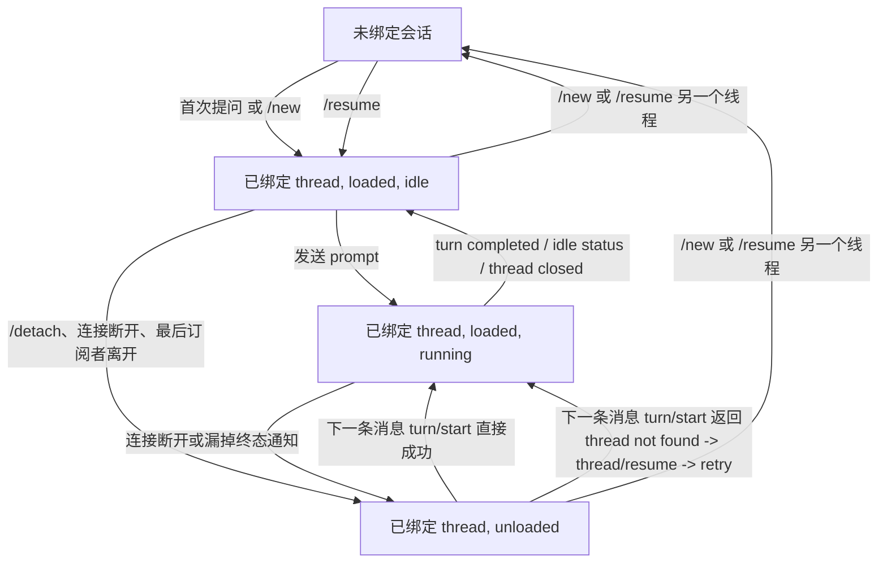

# 飞书侧线程生命周期

英文原文：`docs/contracts/feishu-thread-lifecycle.md`

本文定义飞书侧当前的线程生命周期合同。它解释了：为什么 Feishu 侧必须遵守和 `fcodex`
相同的 backend 协议合同，但运行时恢复策略不能照搬 `fcodex`。

另见：

- `docs/architecture/fcodex-shared-backend-runtime.zh-CN.md`
- `docs/contracts/runtime-control-surface.zh-CN.md`
- `docs/decisions/shared-backend-resume-safety.zh-CN.md`
- `docs/contracts/thread-next-load-settings-semantics.zh-CN.md`
- `docs/contracts/thread-profile-semantics.zh-CN.md`

## 1. 上游基线

- 上游项目：[`openai/codex`](https://github.com/openai/codex.git)
- 当前本地验证基线：`codex-cli 0.118.0`，本地可解析到上游 tag
  `rust-v0.118.0`（commit
  `b630ce9a4e754d35a1f33e4366ba638d18626142`），核对日期为 2026-04-03
- 如果本文后续需要引用具体上游源码位置，应优先使用绑定到该基线
  commit 的 `openai/codex` permalink，而不是开发者本机 checkout 路径

## 2. 必须严格区分的四个状态

对一个飞书会话而言，下列事实不是一回事：

1. `binding`
   - 这个飞书会话逻辑上当前绑定到哪个 `thread_id`
2. `subscription`
   - 当前 live 连接是否仍在订阅这个 thread
3. `loaded runtime`
   - 这个 thread 当前是否仍加载在 app-server 内存里
4. `running turn`
   - 当前是否有 turn 正在执行

飞书侧以 `binding` 作为“这个会话当前接着哪个线程继续聊”的事实来源。
`loaded runtime` 只是一个可恢复的运行态事实，不是绑定事实。

从当前版本起，飞书面对外把这层事实明确收紧为“飞书推送附着态”：

- `attached`
  - 飞书服务当前仍订阅这个 thread
- `detached`
  - binding 还在，但当前飞书会话已不再接收这个 thread 的推送

这只是对 `subscription` 的显式命名收紧，不改变它与 `binding` / `loaded runtime`
必须严格区分的合同。

在运行控制层面，还必须把 `交互 owner` 与 binding/runtime 这两条状态轴区分开。

`交互 owner` 是当前实例内的临时租约；它负责同实例 Feishu / `fcodex` 前端的 turn 发起权与审批、补充输入、中断等交互路由。精确定义见 `docs/contracts/runtime-control-surface.zh-CN.md`。

## 3. 为什么飞书侧不能照搬 `fcodex`

`fcodex` 在正常使用时，通常会维持一个持续存在的 remote TUI 会话。因此：

- websocket 连接通常持续存在
- 当前 thread 往往持续处于订阅状态
- thread 往往也持续保持 loaded

飞书侧不是这样：

- 飞书用户并不持有一个长寿命 TUI 进程
- service 侧 remote 连接可能独立于聊天窗口而中断
- 某个飞书会话明明还应继续同一个 thread，但这个 thread 的 runtime 可能已经被 unload

所以，飞书侧必须在 runtime 丢失后继续保留线程绑定，并在需要时按绑定去恢复 runtime。

## 4. 飞书侧状态图

这张图有意把多条状态轴压缩展示。
真正权威的 binding/runtime/backend 状态转移表，以及 `bound + detached`
下被拒绝 prompt 必须 pure reject 的规则，都定义在
`docs/contracts/runtime-control-surface.zh-CN.md`。

## 5. 运行时恢复规则

### 5.1 unload 不等于解绑

如果 app-server 因“最后一个订阅者离开”而 unload 某个 thread，飞书侧仍必须保留：

- `current_thread_id`
- `current_thread_title`
- 这个飞书会话当前目录等本地状态

不能把 `thread/closed` 或 `turn/start -> thread not found` 直接当成“这个会话不再绑定任何线程”的证据。

### 5.2 `thread/closed` 只表示 runtime 结束

上游 `thread/closed` 的语义，是 thread 已从 app-server 内存中卸下。
它不表示持久化 rollout 已消失。只要 rollout 还在，后续仍可 `thread/resume`。

### 5.3 下一条消息负责重新 load runtime

当某个飞书会话已经绑定了 `thread_id` 时：

1. 先尝试 `turn/start`
2. 如果 app-server 返回 `thread not found`
3. 则调用 `thread/resume`
4. 然后重试一次 `turn/start`

这条规则遵守的是上游协议合同；区别只在于飞书侧更经常进入“已绑定但已 unload”的状态。

### 5.4 在线通知是执行中的主真相源

只要飞书侧当前仍订阅着这个 thread，它就会依赖 live notification 获取：

- 流式回复 delta
- 命令/文件修改日志
- 审批请求
- 各类终态事件

`thread/read` 在飞书侧只承担“快照补账”职责，不承担“宣告运行态已失联”的职责。
因此飞书侧的规则是：

- 运行中的执行卡片，优先相信 live notification
- 收到终态通知时，先按当前 transcript 立即收口执行卡片
- `thread/read` 只用于后台补齐最终回复、补收口、确认 thread 是否已经不再 active
- 如果 `thread/read` 给出了可判定的终态最后一个文本型 `agentMessage`，且终态结果载体已经成功发出，则允许后台再 patch 一次旧 execution card，把这最后一段从 reply 面板里移除
- 一次 `thread/read` timeout 或 transport error，只能把运行通道标记为临时降级，不能清空当前执行锚点

但终态通知可能因为断连、接管、时序问题而漏掉。因此飞书侧仍需要在这些场景主动做 `thread/read` 对账：

- 收到终态信号时
- 收到 `thread/closed` 时
- 执行卡片长时间没有运行时事件时，由 watchdog 主动对账

### 5.5 执行卡片锚点合同

对同一个飞书会话，任一时刻最多只允许一张“当前执行卡片”：

- 当前执行卡片由 `prompt_message_id`、`card_message_id`、`turn_id` 共同锚定
- live notification 的 `thread_id` 只用于定位候选 binding；turn-scoped notification
  必须携带 `turn_id`，且必须与本地当前执行锚点的 `turn_id` 匹配，才允许修改执行卡片、transcript、plan、heartbeat/watchdog 或触发终态收口
- `thread/status`、`thread/closed`、标题、goal 等 thread-level notification 可以没有
  `turn_id`，但必须在候选 binding 仍确认当前 `thread_id` 相同后，才允许刷新当前执行 heartbeat
- 同一条 `turn_id` 校验也约束当前执行的 heartbeat/watchdog：同 thread 的 stale notification
  可以说明后端还活着，但不能刷新当前卡片的 `last_runtime_event_at`，也不能推迟当前卡片的 watchdog 对账
- 对于 `/compact` 这类上游请求立即返回但 `turn_id` 只能等待后续通知才知道的操作，本地执行卡片在 `awaiting_local_turn_started` 且尚无 `turn_id` 时处于“turn 身份未确认”状态；`turn/started` 是主绑定点，若错过该通知，只有当前锚点明确是 `/compact` 且收到 `contextCompaction` 的 `item/started` 时，才允许把该 `turn_id` 补绑定到当前锚点；普通 item/delta/completed、`turn/completed`、`thread/status=idle`、`thread/closed`、watchdog snapshot 都不能单独收口当前卡片或推进 binding FIFO
- 如果未绑定的 `/compact` anchor 在 `compact_start_timeout_seconds` 内既没有收到
  `turn/started`，也没有收到 `contextCompaction item/started` 补绑定，则本地状态明确不可确认。飞书侧必须 fail closed：用“状态不可确认”消息收口这张执行卡片并释放 binding FIFO；不能声称上游 compact 已成功或已失败
- live delta、终态通知、watchdog 补账都只能更新这张当前执行卡片
- 当执行结束后，这张卡片会被收口并退出“当前执行锚点”
- 如果终态后还需要补最终文本，只允许后台按旧 `card_message_id` 回写这张已结束的旧卡片
- 终态权威结果应优先通过单独的 `terminal result card` 发送；只有结果卡预算不足或标记无法安全编码时，才降级为普通文本
- 如果上游先发出 non-retry `error` 通知，而该 turn 最终又没有产生任何文本型 `agentMessage`，则本地必须把这条错误消息保留下来，作为该 turn 的 fail-closed 文本收口；如果后续 snapshot 仍拿到了权威 `final_reply_text`，则以后者为准
- 只有在终态结果载体已经成功送达后，才允许把旧 execution card 中的最终答案段剔除；如果只能回退本地 transcript，或结果载体发送失败，则必须保留旧 execution card 里的最终回复
- 如果剔除最终答案后，旧 execution card 已经不再有任何过程日志或过程性回复可展示，则应把它收口为一张极简终态卡，而不是删除消息；这张极简卡当前固定显示单字 `无`
- 从终态 thread snapshot 里发现的生成图片，只能作为独立的飞书图片消息后续补发；如果该 turn 同时有权威文本终态结果，则必须先送达文本结果，再发送图片。它们不参与 execution card patch，也不改变执行卡片锚点合同
- 如果后续 reconcile 拿到不同于先前载体的权威 `final_reply_text`，必须再次发送更正后的终态结果载体，而不能只修旧 execution card
- 这条终态结果发送路径不重新打开执行锚点，也不改变“同一会话任一时刻最多只有一张当前执行卡片”的约束
- 后续新的本地 prompt 或新的外部 turn，才允许创建下一张执行卡片
- 执行卡片 reply 区的本地长度预算，只约束 display-only 的回复投影文本长度；截断提示本身也必须计入预算，不能出现“正文按上限截断、提示额外附送”的语义

因此，`thread/read` 软失败不能导致“先把当前卡片判死、清空锚点，再被后续事件新开一张卡片”。

binding FIFO 不放宽“一张当前执行卡片”规则。入队的 prompt 或 `/compact`
只能在当前 execution anchor retire 之后出队；`/compact` 出队或立即执行时，也必须先建立本地
execution anchor，再调用上游 `thread/compact/start`。在该 anchor 获得上游 `turn_id` 之前，
迟到的旧 turn 终态信号不能让后续 prompt 穿透执行；只有 `turn/started` 或 `/compact`
专用的 `contextCompaction item/started` 补绑定后，后续 `turn/completed` 才能收口该 anchor。
FIFO 准入细节由
`docs/contracts/scheduled-prompts.zh-CN.md` 定义。

### 5.6 已撤回的排队消息

飞书消息撤回是队列准入信号，不是 running turn 控制信号：

- 如果服务收到某条消息的 `im.message.recalled_v1`，且该消息仍在当前
  owner-binding FIFO 中等待出队，则必须移除这条 queued item，避免它后续出队执行
- 如果该消息已经出队并把 prompt 发给 app-server，撤回事件不能自动取消 running turn；
  用户应使用 `/cancel` 或执行卡片取消按钮
- 客户端里的“删除消息”不是可靠取消信号；只有飞书同时发出并被机器人收到的撤回事件才进入这个合同
- 该行为要求飞书应用订阅 `im.message.recalled_v1`；如果没有该事件，queued prompt
  仍按普通 FIFO 合同处理

本合同暂不引入迟到 receive event 的 freshness gate。迟到送达的消息仍会正常准入，除非它在出队前又被收到的撤回事件取消。

## 6. 与 `fcodex` 的关系

`fcodex` 与飞书侧仍共享同一套 backend 合同：

- 同一个 shared app-server
- 同一套持久化 thread id
- 同样的 `thread/resume` / `turn/start` 语义

不同的只是前端运行时模型：

- `fcodex` 在 TUI 存活期间，通常一直附着在 live backend 上
- 飞书侧更容易进入“绑定还在，但 runtime 已被 unload”的状态

因此最准确的说法是：

- 协议合同相同
- 前端恢复策略不同

## 7. 本文固化的生命周期合同

本文只固化线程生命周期自身负责的合同边界：

- 一个飞书会话只维护一个逻辑上的当前 thread 绑定
- runtime 丢失不会自动清空绑定
- `thread/closed` 被视为 runtime 状态迁移，而不是逻辑解绑
- `thread/read` timeout/transport error 只会标记运行通道降级，不会直接宣告“当前运行态已失联”
- 同一飞书会话同一时刻最多只有一张活动执行卡
- `/new` 与 `/resume` 才是显式改绑操作

下列规则虽然和生命周期紧密相关，但正式归属不在本文：

- `bound + detached` 下 prompt 的 pure reject / attach 规则：见 `docs/contracts/runtime-control-surface.zh-CN.md`
- unloaded thread 恢复路径上的 thread-wise next-load 设置合同：见 `docs/contracts/thread-next-load-settings-semantics.zh-CN.md`
- `/threads`、`/resume`、`/archive` 与本地 `fcodex` continuation 的命令语义：见 `docs/contracts/thread-profile-semantics.zh-CN.md`
- 群聊按 `chat_id` 共享 binding 以及群会话范围规则：见 `docs/contracts/group-chat-contract.zh-CN.md`

## 8. 相关实现文件

- `bot/codex_handler.py`
- `bot/adapters/codex_app_server.py`
- `bot/generated_image_delivery.py`
- `bot/stores/generated_image_delivery_store.py`
- `bot/fcodex.py`
- `bot/fcodex_proxy.py`
- `docs/architecture/fcodex-shared-backend-runtime.zh-CN.md`
- `docs/decisions/shared-backend-resume-safety.zh-CN.md`
